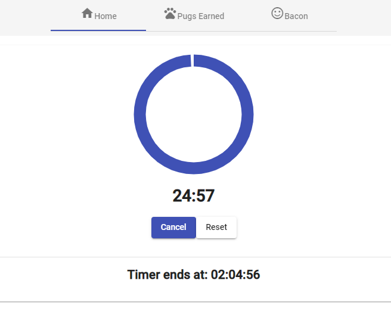
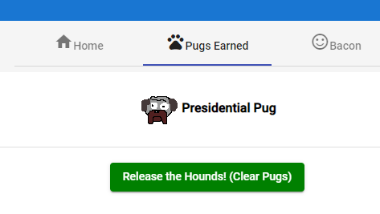

# Pug-O-Doro
### Will Smith, 2019

PWA Demo app for January, 2019 Angular Seattle Meetup





Link to presentation YouTube video on https://www.meetup.com, under the Angular Seattle group.

Presentation slides are in this repo [here](pwa_presentation_slides.pdf)

## Development server

First, `npm install` as usual.

To test the basic app, you can use `ng serve` as usual. This won't have the service worker.

To test the PWA (and Service Worker) functionality, I like to use the node-http-server package:
```
npm install -g http-server
```
Then you can test via:
```
ng build --prod
http-server -c-1 dist/pug-o-doro/ 
```

To limit confusion, I recommend testing in a Guest window of Chrome, and check the Update on Reload checkbox, under Applications -> Service Workers in the Dev Tools 

## Add PWA support to your app

`ng add @angular/pwa`

If things go haywire post-deployment, in `angular.json`, set `serviceWorker: false` and the ngsw will uninstall itself.

## `ngsw` Debug endpoint

If you're running `http-server` as above, http://127.0.0.1:8080/ngsw/state will give you some exciting information!

## Source Files of Interest to PWA's

In the demo, these are the main files I was talking about:

* ngsw-config.json
  * Added cache configurations for Material assets (css and .woff2 fonts,) image assets, and a `dataGroups` entry for the Bacon Ipsum API. Note that order is important--generally, you should have your `installMode: prefetch` assetGroups before your `installMode: lazy` assetGroups.

* `src/app/app.component.ts` and `src/app/app.component.html`
  * These cover most of the code I showed in the presentation. See swpush-notes.md for more info on SwPush.
* `assets/`
  * Generated by https://app-manifest.firebaseapp.com and http://favicon-generator.org tools. Be sure to use square images when using these tools to avoid surprises.
  
### Have fun!
